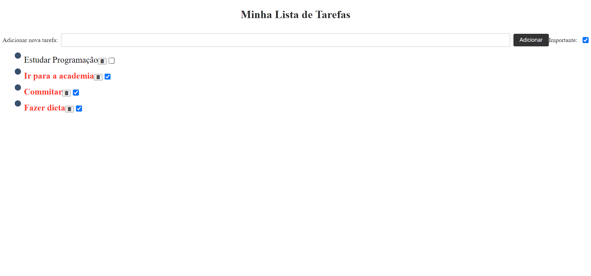

# Lista de Tarefas

## Descrição
A Lista de Tarefas é um aplicativo web simples para gerenciar suas tarefas diárias. Este projeto foi desenvolvido como parte do meu aprendizado em desenvolvimento web.

## Funcionalidades Principais
- Adição de novas tarefas.
- Remoção de tarefas concluídas.
- Marcação de tarefas como concluídas.
- Armazenamento local das tarefas utilizando o LocalStorage do navegador.
- Interface intuitiva e fácil de usar.

## Tecnologias Utilizadas
- HTML5
- CSS3 (com pré-processador SASS/SCSS)
- JavaScript
- Bootstrap (opcional, dependendo da preferência e necessidade de um framework CSS)
- Git (para controle de versão)

## Como Utilizar
1. Clone o repositório (`git clone https://github.com/AngeloHervis/Lista-de-Tarefas.git`).
2. Abra o arquivo `index.html` em seu navegador web.
3. Adicione novas tarefas digitando o texto no campo de entrada e pressionando Enter.
4. Marque uma tarefa como concluída clicando na caixa de seleção ao lado dela.
5. Remova uma tarefa clicando no botão de remoção ao lado dela.

## Autor
Angelo Hervis
- GitHub: [AngeloHervis](https://github.com/AngeloHervis)
- LinkedIn: [Angelo Hervis](https://www.linkedin.com/in/angelo-hervis/)